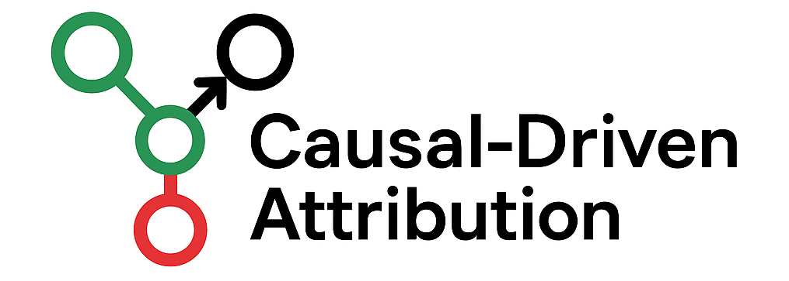
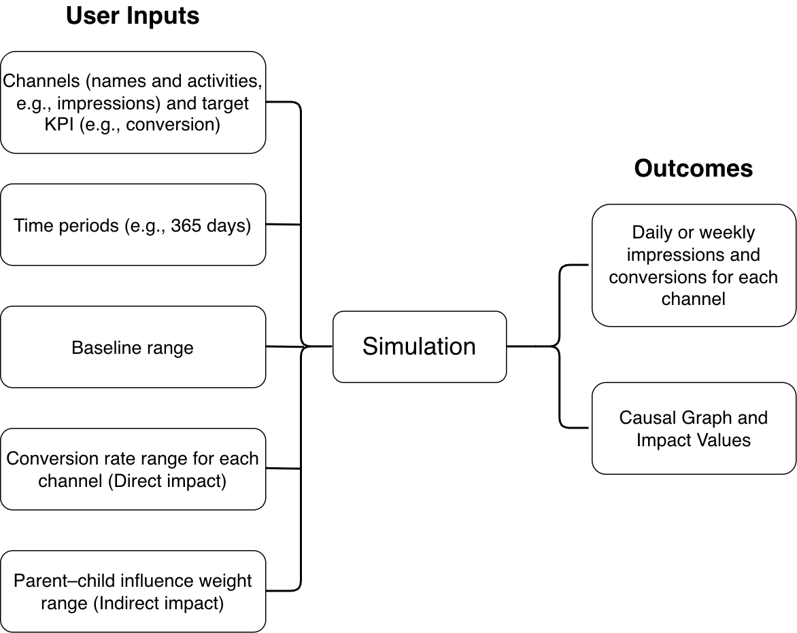
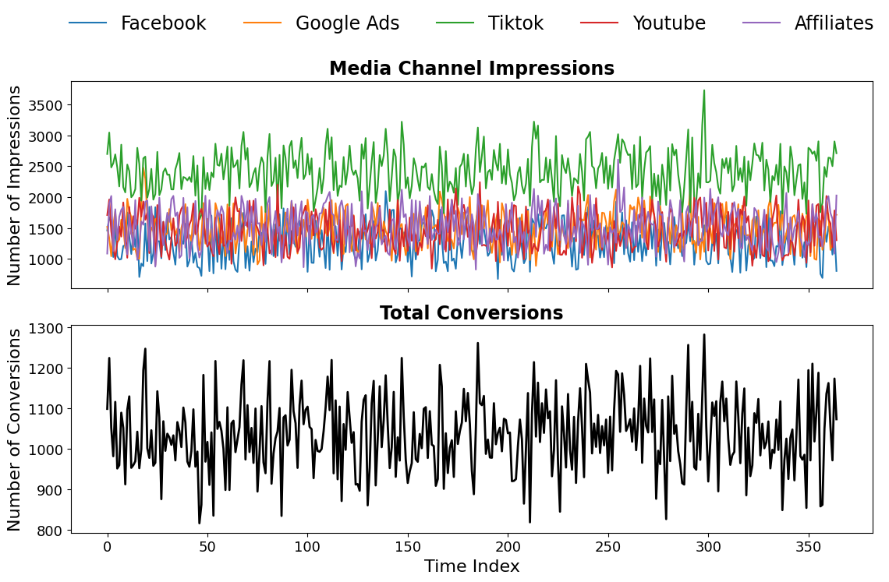
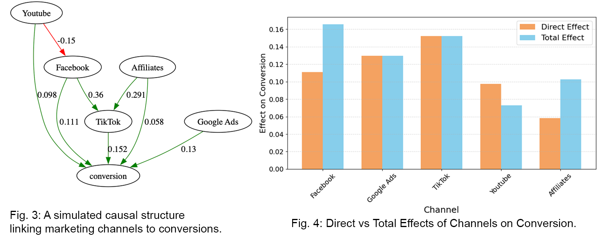

<p align = "center" draggable=”false” >
</p>

# <h1 align="center" id="heading"> Estimating channel influence without user-level data
[![Python][Python.py]][Python-url] 
[![JupyterNotebook][JupyterNotebook.py]][JupyterNotebook-url]
[![CausalAI][CausalAI.py]][CausalAI-url]

---
# Introduction & Key Features
This research introduces a Causal-Driven Attribution (CDA) framework that estimates channel influence exclusively from aggregated impression-level data, requiring no user identifiers or click-path tracking. Our method integrates a causal discovery algorithm and a computational approach that identifies directional causal relationships from observational data using score-based methods. Through this process, we gain **graphical causal graphs and signigicant causal effects estimations**. For more details about modelling, please refer to the [Causal-driven attribution](#causal-driven-attribution) section.


Moreover, we developed an approach that allowed us to generate a **synthetic dataset**. Our aim is not only to create a comprehensive and representative marketing dataset but moreover to be able to establish the so-called ground truth required for model validation, thereby bypassing the problem of insufficient data. For details on how to generate synthetic data for experiments, see the [Data Generation](#data-generation) section.

## Data Generation
We provide an open-source Python package that allows users to simulate data from scratch. Here’s how it works:

1. Users input characteristics about their business such as media channels and plausible ranges for conversion rates based on their historical experience with those channels.

2. The simulation models the data according to the specified assumptions and formulas, adding statistical noise to each generated sample.

3. The outputs are:

    1) A synthetic dataset for causal marketing attribution

    2) A causal graph showing relationships between channels and their individual effects on others.

### Example of simulation in action

<figure style="text-align: center;">
  
  <figcaption>Figure 1: Overview of the simulation framework.</figcaption>
</figure>

## Causal-driven attribution


---
## Environment Setup
### Clone the Repository

```bash
git clone https://github.com/Tayerquach/causal_driven_attribution.git
cd causal_driven_attribution
```

### Initialise the environment
After cloning repository github, going to the main folder `causal_driven_attribution` and do the steps as follows

1. If you have not installed Python, please install it first:

   Install Python (<a target="_blank" href="https://wiki.python.org/moin/BeginnersGuide">Setup instruction</a>).
   
   **Note**: In this project, we used Python 3.10.18
2. Install Conda (<a target="_blank" href="https://conda.io/projects/conda/en/latest/user-guide/install/index.html">Conda Installation</a>), or miniconda (<a target="_blank" href="https://www.anaconda.com/docs/getting-started/miniconda/install">Miniconda Installation</a>), or similar environment systems
3. Create a virtual enviroment
```console 
conda create --name [name of env] python==[version]
```
Example:
```console 
conda create --name causal python==3.10.18
```
4. Check list of conda environments
```console 
conda env list
```
5. Activate enviroment
```console 
conda activate [name of env]
``` 
6. Install Python packages
```console 
pip install -r requirements.txt 
``` 

⚠️ Important:
This project uses the Graphviz rendering engine to visualize causal graphs.
Installing the Python package graphviz (via `pip` or `poetry`) is not enough. You must also install the system-level `Graphviz` engine.

**MacOS installation**

If you are running the project on macOS, install `Graphviz` using `Homebrew` after setting up the Python environment:

```bash
brew install graphviz
```

**Ubuntu / Linux installation**

If you are running the project on Ubuntu or another Linux distribution, install Graphviz using:
```
sudo apt update
sudo apt install graphviz
```
---

## Reproduction

### Data Simulation

To generate marketing attribution data as shown in the [Data Generation](#data-generation) section, please refer to the notebook at `reproduce/examples/example_simulation.ipynb`. The simulated attribution data is shown below.

<figure style="text-align: center;">
  
  <figcaption>Figure 2: A random simulated data illustrating marketing channel impressions and conversions within 365 days.</figcaption>
</figure>


<figure style="text-align: center;">
  
</figure>

For running multiple simulations, first configure the number of `SEED`s in the `reproduce/utils/configs.py` file. If you would like to modify any parameter values such as the number of channels, conversion rates, and so on, please do so in the `config.py` file.
<details>
<summary><code>reproduce/utils/configs.py</code></summary>

```python
# Node definitions
NODE_LOOKUP = {
    0: "Facebook",
    1: "Google Ads",
    2: "TikTok",
    3: "Youtube",
    4: "Affiliates",
    5: "conversion",
}

# Name of the activity (e.g., "impression", "click", "spend")
ACTIVITY_NAME = "impression"

# Target sink node
TARGET_NODE = "conversion"

# Time series length (days)
TIME_PERIODS = 365  # 1 year of daily data

# Base value range for impressions
BASE_RANGE = (1000, 2000)

# Number of random seeds to generate
N_SEEDS = 1000
```
</details>


Then, run the following command line:

```
python -m reproduce.generate_data
```

After the simulation, the generated data will be saved in `reproduce/results/data`.

### Causal DAG Discovery

#### Choice of time lag
The choice of time lag in PCMCI determines how far back in time the algorithm looks to identify causal relationships between time series variables. Selecting an appropriate lag is important for producing meaningful and computationally feasible causal models. In marketing, incrementality lift tests are commonly used to measure causal impact, meaning they help determine what actually caused a change in performance. If $\tau_{\max}$ is set too small, the algorithm may miss true causal effects that occur at longer lags, resulting in incomplete or misleading causal graphs. On the other hand, setting $\tau_{\max}$ too large increases the number of lagged variables under consideration, which may slow down computation. In marketing dynamics, incrementality lift tests are often run over short windows such as 7, 14, or 30 days. In this section, we run experiments using 1,000 random samples and vary $\tau_{\max}$ from 0 to 59 to determine the optimal lag range for causal discovery in this context.

* **Running Experiments**: To re-run the experiment, please run this command

```
python -m reproduce.run_experiment --seed_min=0 --seed_max=999 --tau_min=0 --tau_max=59
```
**Note**: You can modify the values depending on your study.

After running the experiment, the outcomes will be saved in `reproduce/results/eval`.

* **Evaluation**: To evaluate the causal graph discovery results, please refer to `run_evaluation.ipynb` to see the evaluation metric scores (AUC, TPR, FPR, and F0.5) for 1,000 predicted causal DAGs.


### Causal Effect Estimation


#### Sample Examples
Please refer to the paper to get the explanation about the suitable $\tau_{\max} = 30$ can be used for our CDA model. Now, the instructions below will show us how to 


#### Mutilple sample


<!-- MARKDOWN LINKS & IMAGES -->
[Python.py]: https://img.shields.io/badge/python-3670A0?style=for-the-badge&logo=python&logoColor=ffdd54
[Python-url]: https://www.python.org/

[JupyterNotebook.py]: https://img.shields.io/badge/Jupyter%20Notebook-F37626?style=for-the-badge&logo=jupyter&logoColor=white
[JupyterNotebook-url]: https://jupyter.org/

[CausalAI.py]: https://img.shields.io/badge/Causal%20AI-1E90FF?style=for-the-badge&logo=dowhy&logoColor=white
[CausalAI-url]: https://py-why.github.io/dowhy/
